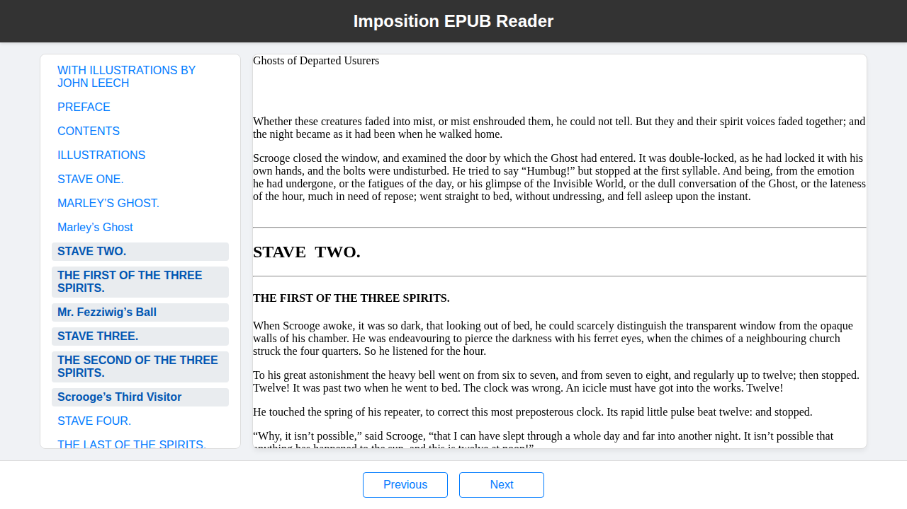

# Imposition

This is the initial implementation of the `Imposition` library, a Python library intended to run under Pyodide for parsing and rendering EPUB files.



## Installation

This package is not yet available on PyPI. To install it, you must build the wheel from the source and then install it using `pip`:

```bash
hatch build
pip install dist/imposition-0.1.0-py3-none-any.whl
```

## Requirements

The library and demo require Pyodide v0.29.1 or later.

## Quick Start

The following example demonstrates how to load an EPUB file and render it in a web page.

```python
import asyncio
import js
from imposition.book import Book
from imposition.rendition import Rendition

async def main():
    response = await js.pyfetch("test_book.epub")
    epub_bytes_proxy = await response.bytes()
    epub_bytes = epub_bytes_proxy.to_py()

    book = Book(epub_bytes)
    rendition = Rendition(book, "viewer")

    js.window.rendition = rendition

    rendition.display_toc()
    rendition.display(book.spine[0])

if __name__ == "__main__":
    asyncio.run(main())
```

## Contributing

Contributions are welcome! Please see the [Contributing Guidelines](CONTRIBUTING.md) for more information on how to get started.

## Changelog

For a detailed list of changes, please see the [Changelog](CHANGELOG.md).

## License

This project is licensed under the Apache 2.0 License. See the [LICENSE](LICENSE) file for details.

## Error Handling

The library uses a custom exception hierarchy to report errors during EPUB parsing. All exceptions inherit from `imposition.ImpositionError`.

- **`ImpositionError`**: The base class for all exceptions in the library.
- **`InvalidEpubError`**: Raised for general EPUB format errors, such as malformed XML files or missing required elements.
- **`MissingContainerError`**: A subclass of `InvalidEpubError`, raised specifically when the `META-INF/container.xml` file is not found in the EPUB archive.

When using the library, it's recommended to wrap the `Book` constructor in a `try...except` block to handle these potential errors:

```python
from imposition import Book, ImpositionError

try:
    book = Book(epub_bytes)
except ImpositionError as e:
    print(f"Error loading book: {e}")
```

## Roadmap

For a detailed competitive analysis and the strategic reasoning behind this roadmap, please see [`COMPETITIVE_ANALYSIS.md`](./COMPETITIVE_ANALYSIS.md).

**Note:** The following roadmap is a strategic overview. For the most up-to-date list of priorities, please see the [GitHub issue tracker](https://github.com/webmaven/imposition/issues).

### Phase 1: Minimum Viable Product (MVP)

1. **Table of Contents:**
    - **Priority:** High
    - **Rationale:** Essential for basic navigation.
2. **Chapter Navigation (Next/Previous):**
    - **Priority:** High
    - **Rationale:** Core functionality for a reading application.
3. **Font Size Adjustment:**
    - **Priority:** Medium
    - **Rationale:** A common and expected feature for readability.

### Phase 2: Core Feature Expansion

1. **Location & Pagination (CFI):**
    - **Priority:** High
    - **Rationale:** Enables saving and restoring the user's position.
2. **Custom Themes (Light/Dark):**
    - **Priority:** Medium
    - **Rationale:** A popular feature for user comfort.
3. **Search (within the book):**
    - **Priority:** Medium
    - **Rationale:** A valuable tool for research and navigation.

### Phase 3: Advanced Features

1. **Annotations (Highlighting & Notes):**
    - **Priority:** High
    - **Rationale:** A key feature for students, researchers, and active readers.
2. **Bookmarks:**
    - **Priority:** Medium
    - **Rationale:** A user-friendly way to save important locations.
3. **Spreads (Two-page view):**
    - **Priority:** Low
    - **Rationale:** A nice-to-have feature, but not essential for a first version.

### Phase 4: Long-Term Vision

1. **Accessibility Features (TTS, Dyslexia Fonts):**
    - **Priority:** High
    - **Rationale:** A key differentiator and a socially responsible goal.
2. **OPDS Catalog Support:**
    - **Priority:** Medium
    - **Rationale:** Enables users to browse and add books from online catalogs.
3. **DRM (LCP) Support:**
    - **Priority:** Low
    - **Rationale:** A complex feature that is only necessary for commercial applications.
